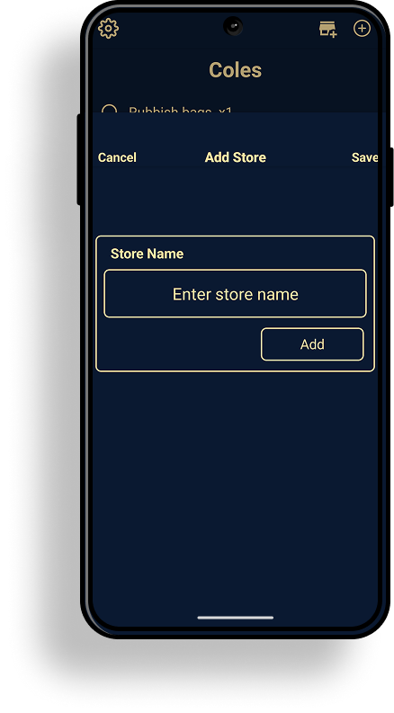
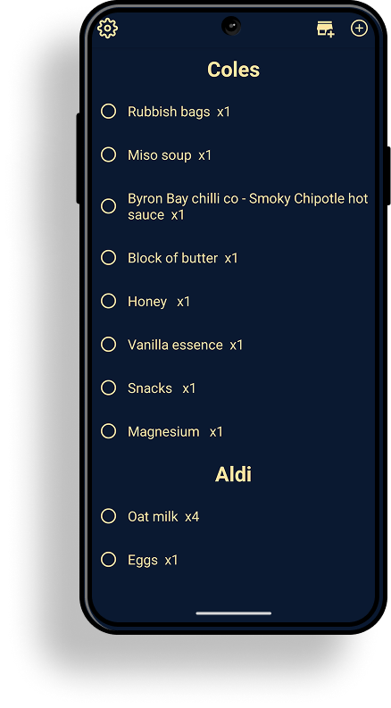

# 🛒 Shopping Run

Shopping Run is a mobile app built with [Expo](https://expo.dev/) that helps you organize shopping lists across multiple stores.  
It’s lightweight, works offline, and keeps your data stored locally on your phone using SQLite.  

## ✨ Features

- 📍 **Multiple Stores** – Create and manage shopping lists for different stores.  
- 📝 **Item Management** – Add, delete, and check off items per store.  
- ✅ **Check-off & Reset** – Mark items as picked up and reset your lists when you’re done.  
- 💾 **Offline Storage** – All data is saved locally on-device using SQLite.  
- ⚡ **State Management** – Powered by [Legend State](https://legendapp.com/open-source/state/), making it easy to share and update state across components.  

## 🛠️ Tech Stack

- [Expo (React Native)](https://expo.dev/) – cross-platform app framework  
- [SQLite](https://docs.expo.dev/versions/latest/sdk/sqlite/) – local database for persistent storage  
- [Legend State](https://legendapp.com/open-source/state/) – global state management  
- [TypeScript](https://www.typescriptlang.org/) – type-safe development  

## 📸 Screenshots (optional)

### Add Store Screen


### Shopping List Screen


## 🚀 Getting Started

### Prerequisites
- [Node.js](https://nodejs.org/) and [npm](https://www.npmjs.com/) (or Yarn)  
- [Expo CLI](https://docs.expo.dev/more/expo-cli/) installed globally  

### Installation
1. Clone this repository:
   ```bash
   git clone https://github.com/yourusername/shopping-run.git
   cd shopping-run

2. Install dependencies:
npm install
or
yarn install

3. Start the development server:
expo start